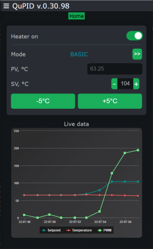
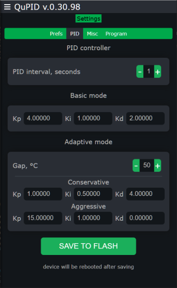
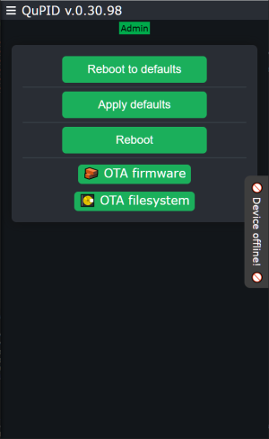
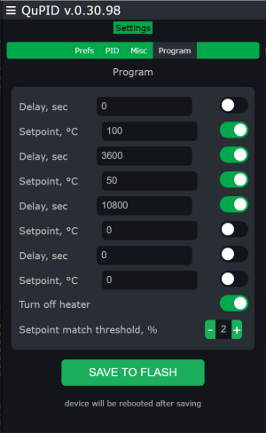
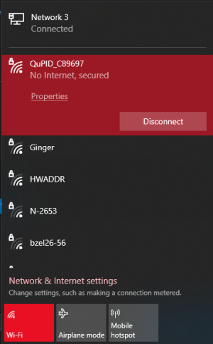
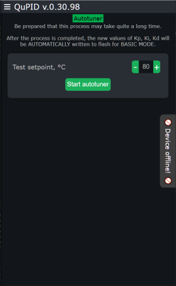
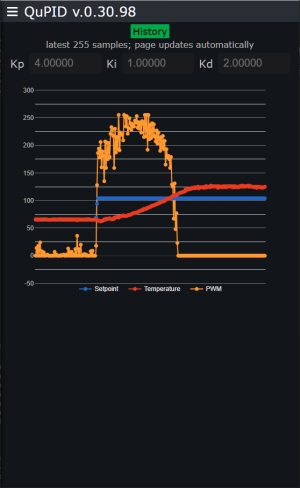

#  QuPID

the only temperature controller with a heart

It is a PID temperature regulator for ESP8266 with dual control: direct (rotary encoder and LED display), or via browser using WiFi.

## What it was designed for

Device maintains the heater temperature as close to the setpoint as possible. This code, without any modifications, was tested in:

* repairing modern electronic devices
* chemical reactions
* soldering electronic boards
* work with special resins and molds
* drying fruits and mushrooms at precisely controlled temperatures

>[!WARNING]
>The device was originally created for personal use, so any flaws I didn't notice may show up if your usage pattern is different from mine.

## Controls

Controlling the thermostat with physical controls is simple, if not primitive:

* increase the temperature
* decrease the temperature
* change PID mode
* start the program mode
* show the WiFi hotspot password on the display

Over WiFi you have the same as above (except showing Wifi password), plus:

* change the gains (Kp, Ki, Kd)
* setting of startup parameters (default temperature, default PID configuration)
* enable or disable logging of SV, PV and PWM values
* displaying temperature graphs
* program mode settings
* autotuner
* OTA firmware update

   

## Program mode

In this mode the thermostat runs a simple program like "heat up to 100°C, keep the temperature for one hour, then cool down to 50°C, keep it for three hours, then turn off the heater". The "program mode" can only be set via WiFi, but once set and saved to flash, it can be turned on with a physical button. Here's what the program mode control panel looks like:

 

## Flashing the firmware

[Here](https://nodemcu.readthedocs.io/en/latest/flash/) is an article about flashing NodeMCU. In short, you will need either the CLI tool [esptool](https://github.com/espressif/esptool) or GUI app [NodeMCU flasher](https://github.com/marcelstoer/nodemcu-pyflasher), install it, then download and unpack the latest available release of QuPID and write both files in your ESP8266 module.

## Connecting

To connect to the device via WiFi:

* press the encoder button repeatedly until the hotspot password appears on the display
* connect to the WiFi network "QuPID_xxxxxxx", where "xxxxxxxx" is the MAC address of your ESP8266.
* point your browser to [192.168.190.1](http://192.168.190.1/).
* done!

>[!NOTE]
>The password is created based on the MAC address of your MCU, so (1) it will be different on different modules, and (2) you cannot change it via the control panel. You can set it in the code, though.

(btw, login and password for OTA updates - ota/ota)

 

## PID modes and setting

* Basic mode, where a setpoint can be set and the unit maintains it
* Adaptive mode, where heating to the target temperature is faster due to two sets of gains (Kp, Ki, Kd) -- "conservative" and "aggressive".
* by default, PID controller being called with interval of 1 second, but this interval can be increased. Useful for massive objects like boilers, distillers, etc.
* there is an "Autotuner" that calculates the gains automatically. Unfortunately, this is a long procedure and usually requires later tuning.

   

You don't need to graph manually (or by third-party programs) to see undershoot/overshoot. To make tuning easier, there are two types of graphs in the web panel: a "live graph" and an "history buffer" where stored latest 255 cycles of the PID controller. Both graphs display three metrics: setpoint (SV), temperature (PV), and heater power (PWM). Watching the graph helps you adjust the gains to minimize overshoot/undershoot. Of course, there is output of the same data via serial port for analysis.

## Compilation

All you need is [https://platformio.org/](Platformio). This repository contains all needed libraries and other dependencies, so no library hunt is needed.

>[!IMPORTANT]
>Don't forget to build and upload Filesystem Image!

## Parts and modules

A handful of components totaling a dozen pounds sterling (this is of course assuming you already own a heater).

* NodeMCU v3 (ESP8266) - £2
* MAX6675 K-type Thermocouple Module & Sensor - £4
* MAX7219 8-Digit 7-Segment Display Module - £2
* Rotary Encoder Module 20IMP/REV W/BUTTON (I recommend the module with anti-bounce capacitors.) - £1
* a pair of triacs (BT137 and MOC3061) or an off-the-shelf SSR module - £2-10
* three resistors, wires and such - £0.5
* old smartphone charger - free

## Wiring

Wiring plan is not ready yet, but you have this:

* Thermal sensor
  * MAX6675 SCK -> D0
  * MAX6675 CS -> D1
  * MAX6675 SO -> D2

* Display
  * MAX7219 DIN -> D8
  * MAX7219 CLK -> D7
  * MAX7219 CS -> D3

* Encoder
  * Button -> 3 (RX pin)
  * CLK -> D6
  * DT -> D5

* Triac, or a solid-state relay -> D4

## Third-party libraries and stuff used in the sketch

* [QuickPID](https://github.com/Dlloydev/QuickPID) by David Lloyd
* [Arduino PID AutoTune Library](https://github.com/br3ttb/Arduino-PID-AutoTune-Library) by [Brett Beauregard](https://brettbeauregard.com)
* [max7219](https://github.com/JemRF/max7219) by JemRF
* [arduino-multi-button](https://github.com/poelstra/arduino-multi-button) by Martin Poelstra
* [GyverMAX6675](https://github.com/GyverLibs/GyverMAX6675) by GyverLibs
* [GyverPortal](https://github.com/GyverLibs/GyverPortal) by GyverLibs
* Heart favicon by [Icons8](https://icons8.com/)
